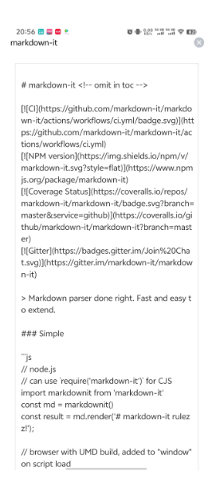

# mydiary
程序员的个人日记，主要使用markdown格式进行书写，也可作为markdown的安卓端编辑器

## 第一版计划
- 支持创建markdown格式的日记，并能保存到本地 （已完成）
- 支持预览markdown格式的日记文档并能重新编辑和保存 （已完成）
- 支持日记按更新时间倒叙展示本地日记列表 （已完成）
- 支持浏览本地文件夹中的其他mark down格式的文件并打开 (todo)
- 支持其他md文件使用mydiary应用预览 （todo）
- 支持编辑markdown时候可以使用markdown语法快捷导入（todo）

## 使用的技术栈
- uniapp + vue3
- [uni-ui](https://zh.uniapp.dcloud.io/component/uniui/uni-ui.html)
- [markdown-it](https://github.com/markdown-it/markdown-it)

## 预览

目前仅在安卓手机端测试通过，其他平台未测试；欢迎其他伙伴参与贡献；也欢迎联系我讨论技术问题
(email: 1243304602@qq.com; weixin: 1243304602)
